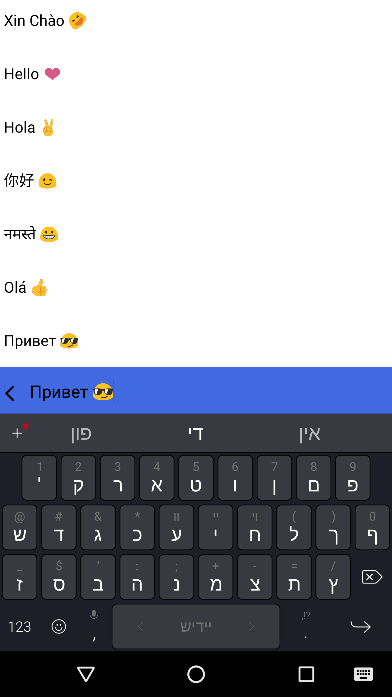

# GdxChat

> Example demonstrates how to implement a full edit text and text view (with multilanguage, icon) in a libgdx project.

 

## Usage example

- Implement full text search feature
- Implement full text chat feature

## TODO

- IOS
- Desktop

## Meta

Chaomao – [@Twitter](https://twitter.com/ChaomaoApps) – chaomao.help@gmail.com

Distributed under the MIT license. See ``LICENSE`` for more information.

[https://github.com/ChaomaoApps](https://github.com/dbader/)

## Contributing

1. Fork it (<https://github.com/ChaomaoApps/GdxChat/fork>)
2. Create your feature branch
3. Commit your changes
4. Push to the branch
5. Create a new Pull Request

<!-- Markdown link & img dfn's -->
[npm-image]: https://img.shields.io/npm/v/datadog-metrics.svg?style=flat-square
[npm-url]: https://npmjs.org/package/datadog-metrics
[npm-downloads]: https://img.shields.io/npm/dm/datadog-metrics.svg?style=flat-square
[travis-image]: https://img.shields.io/travis/dbader/node-datadog-metrics/master.svg?style=flat-square
[travis-url]: https://travis-ci.org/dbader/node-datadog-metrics
[wiki]: https://github.com/yourname/yourproject/wiki
